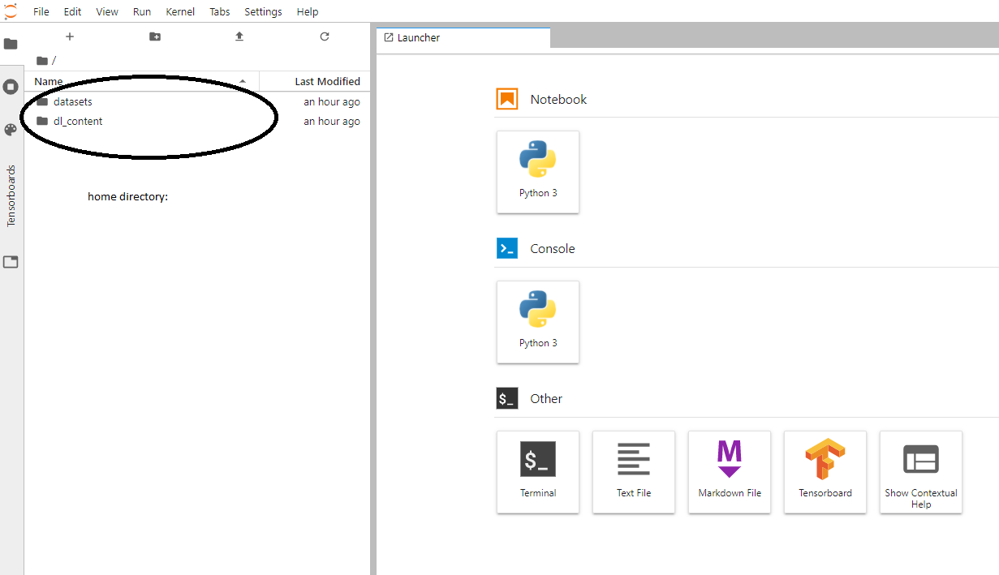
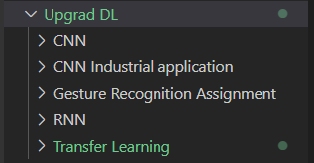
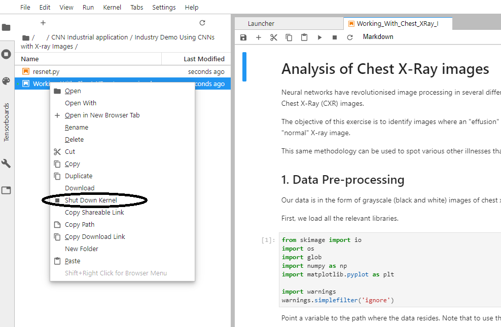
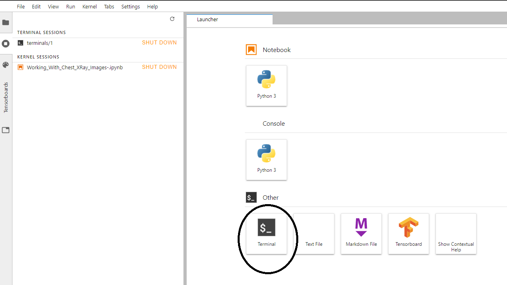

# Welcome to cloud based lab for deep learning module.

## TOC:
- What is where?
- Common gotchas to avoid?

### What is where?
The folder structure is given below:

As you can see there are two main folders when you log in:

1. **datasets:** This is where all the datasets you will need to run the notebooks are kept. (There are some additional files as well you can ignore them). So in the virtual machine you have logged into the path to this folder will be `/home/datasets`

2. **dl_content:** This is where all the code files are kept. You will need to refer to the directory `Upgrad DL` within `dl_content`.

As you can see the folder structure is loosely based on the deep learning course on Upgrad Platform. You will be working with the `.ipynb files.`

 ### Common gotchas to avoid

 1. **Always shut down the notebooks when you are done your work**

2. **Don't run two notebooks (if using tensorflow) simultaneously**
   
Tensorflow has the tendency to use all the gpu memory. If you are running one notebook in which you are training a tensorflow model, trying to run another notebook and training a tensorflow model will give you an error.

3. **Don't install too many python libraries in the main environment**
 
 Commonly used libraries that you will need to run the codes and submit assignment/case study are already installed. In case you need to install many new libraries, make use of the terminal and create a separate virtual environment and install the libraries in that venv and use that venv. [Learn how to create virtual environments](https://packaging.python.org/guides/installing-using-pip-and-virtual-environments/)

